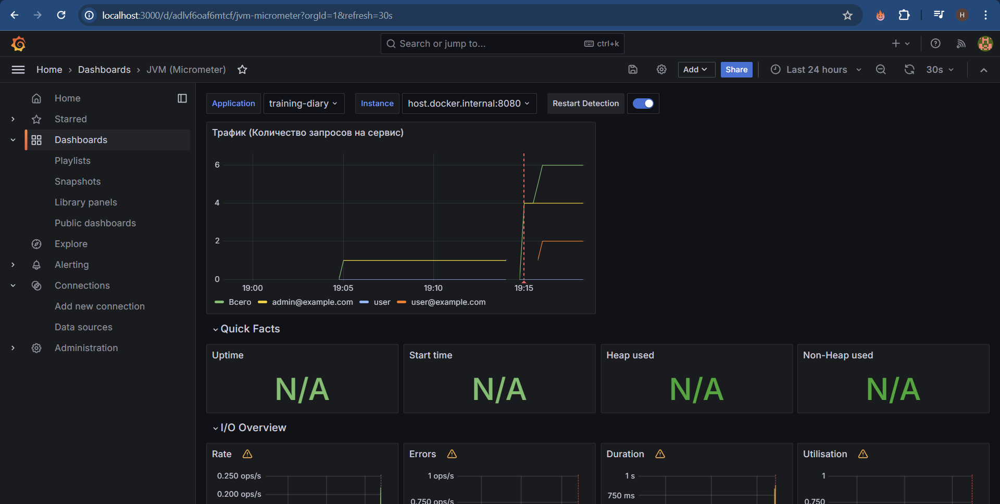

# Training Diary (homework - 5)
 Приложение для ведения дневника тренировок, которое позволит пользователям записывать свои тренировки, просматривать их и анализировать свой прогресс в тренировках.

## Инструкция сборки и запуск проекта

1) Загружаем проект к себе
2) Вводим команду ``` docker-compose up -d ``` для поднятия контейнера с бд, prometheus, victoriametrics и grafana
3) Собрать стартер аудита:
    - ``` cd .\audit-spring-boot-starter\ ```
    - ``` mvn clean install -U ```
    - ``` cd .. ``` 
4) Собрать стартер logging:
   - ``` cd .\logging-spring-boot-starter\ ```
   - ``` mvn clean install -U ```
   - ``` cd .. ```
5) Собрать приложение: ``` mvn clean package -DskipTests ```
6) Заходим в ``` com.ylab.intensive.TrainingDiaryApplication.java ``` запускаем проект через зеленную кнопку.

## Инструкция запуска тестов
1) Заходим в ``` src/test/java/com/ylab/intensive/TestLauncher.java ``` и запускаем тесты в классе TestLauncher через зеленную кнопку.

## Endpoints 

#### Swagger: GET http://localhost:8080/swagger-ui/index.html

 - Там находятся все эндпоинты приложения
 - При вставке токена НЕ НУЖНО указывать Bearer! Просто вставьте токен ``` YOUR_TOKEN ```

#### Actuator: GET http://localhost:8080/actuator/prometheus

 - Возвращает метрики приложения в формате, который может быть собран и обработан Prometheus.

#### Grafana: GET http://localhost:3000/connections/datasources/new

 - нажмите Prometheus
 - в поле url введите ``` http://host.docker.internal:9090 ```
 - сохраните
 - Зайдите в ``` Dashboards``` в левой окошке
 - Нажмите кнопку ``` create Dashboards ```
 - Нажмите ``` импорт Dashboards ```
 - Введите ``` 4701 ``` и нажмите на кнопку импорт. Это JVM (Micrometer)
 - Теперь там можно настраивая параметры мониторить состояние приложения и при необходимости собирать метрики, пример: 



## Технологии
- Java 17
- Spring Boot 3
- Spring Framework 6
- Spring Security
- Spring AOP
- Spring Actuator
- Spring Cache
- Spring Jdbc
- SpringDoc + Swagger UI
- База данных PostgreSQL
- Миграция данных через Liquibase
- JWT
- Lombok
- log4j
- jackson
- Mapstruct
- Micrometer
- hibernate-validator
- assertj
- JUnit 5
- Platform-launcher
- Testcontainers
- Aspectj
- Docker
- Maven
- Grafana
- Prometheus


## Структура базы данных
(Пароли хранятся в зашифрованном виде)


### Training Diary. Домашнее задание 'Spring boot'
### Необходимо обновить сервис, который вы разработали в первом задании согласно следующим требованиям и ограничениям
### Требования:

- Spring Boot 3.2.0 с использованием необходимых стартеров
- Обновить тесты
- Аспекты аудита и логирования вынести в стартер, сделать отдельным модулем. Один стартер должен автоматически подключаться, второй через аннотацию @EnableXXX
- Swagger -> SpringDoc