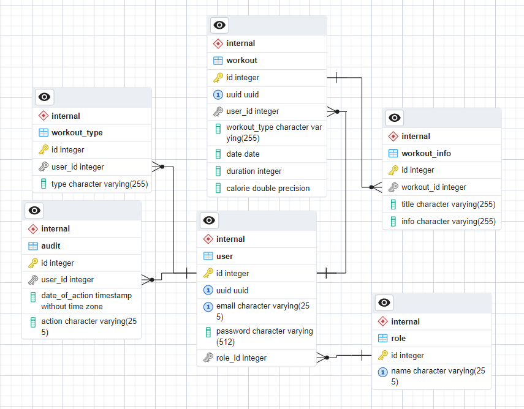

# Training Diary ( homework - 3)
 Приложение для ведения дневника тренировок, которое позволит пользователям записывать свои тренировки, просматривать их и анализировать свой прогресс в тренировках.

## Инструкция сборки и запуск проекта
1) загружаем проект к себе
2) Вводим команду ``` docker-compose up ``` для поднятия контейнера с бд
3) Собрать приложение: ```  mvn clean package -DskipTests ```
4) Запустить через контейнер сервлетов Tomcat не ниже 10 версии (можно использовать плагин Smart Tomcat)

## Инструкция запуска тестов
1) заходим в ``` src/test/java/com/ylab/intensive/TestLauncher.java ``` и запускаем тесты в классе TestLauncher через зеленную кнопку.

## Технологии
- Java 17
- Jakarta EE
- Tomcat 10
- База данных PostgreSQL
- Миграция данных при помощи Liquibase
- JWT
- Mapstruct
- JUnit 5
- Testcontainers
- Aspectj
- Docker
- maven
- CDI

## Структура базы данных


### Training Diary. Домашнее задание Servlet API и AOP
### Необходимо обновить сервис, который вы разработали в первом задании согласно следующим требованиям и ограничениям
## Требования:

- Все взаимодействие должно теперь осуществляться через отправку HTTP запросов

- Сервлеты должны принимать JSON и отдавать также JSON

- Для сериализации и десериализации использовать jackson

- Использовать понятное именование эндпоинтов

- Возвращать разные статус-коды

- Добавить  DTO (если ранее не было заложено в логике)

- Для маппинга сущностей в дто использовать MapStruct

- Реализовать валидацию входящих ДТО

- Аудит переделать на аспекты через аннотацию

- Также реализовать на аспектах логирование выполнения любого метода (с замером времени выполнения)

- Сервлеты должны быть покрыты тестами

## The endpoints are located in the ``` .jetclient/training-diary ```  folder